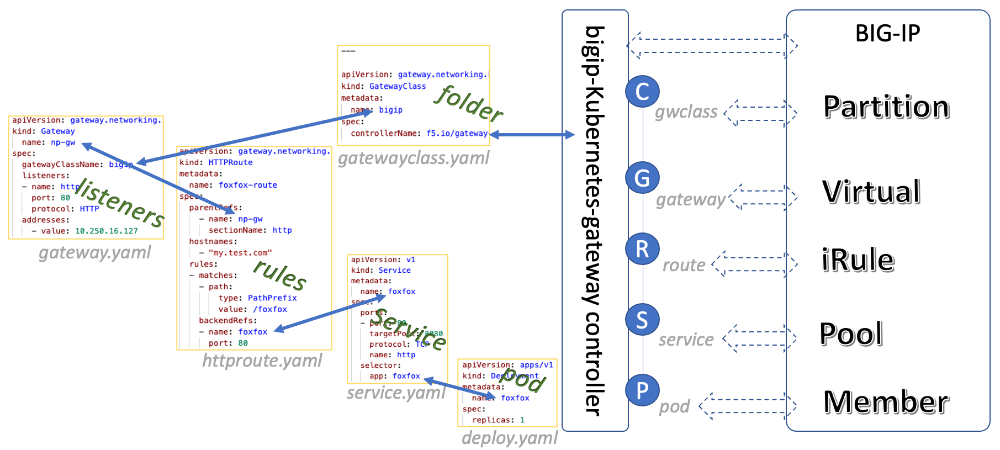

# Overview

This project aims to follow the Kubernetes [Operator pattern](https://kubernetes.io/docs/concepts/extend-kubernetes/operator/){:target="_blank"}.

It uses [Controllers](https://kubernetes.io/docs/concepts/architecture/controller/){:target="_blank"}.
which provides a reconcile function responsible for synchronizing resources untile the desired state is reached on the cluster 

### Framework and Workflow Design

 Basically, bigip-kubernetes-gateway architecture is designed as follows:

* It uses `kubebuilder` and `controller-runtime` framework to connect to the k8s cluster side and receive user operation events on various resources such as Gateway, HTTPRoute, Service, etc.
* It uses `f5-bigip-rest` module to connect to BIG-IP via iControl REST to do resource deliveries and deployments.
* Between the upstream and downstream, it uses a queue to decouple event processing and delivery logic.

The correspondence between gateway-related resources and BIG-IP resources is as follows:

From the above figure, we can see the correspondence between gateway-related resources and each resource on BIG-IP, that is, when using BIG-IP as a provider, the specific form of each gateway resource on BIG-IP is:

| K8S Resources      | BIG-IP Resources |
| ----------- | ----------- |
|Controller | BIG-IP Device |
| GatewayClass      |  Partition       |
| Gateway   | Virtual        |
|HTTPRoute| iRule|
|Service|Pool|
|Deploy(pods)|Member|

The association of resources can be compared to a tree:

