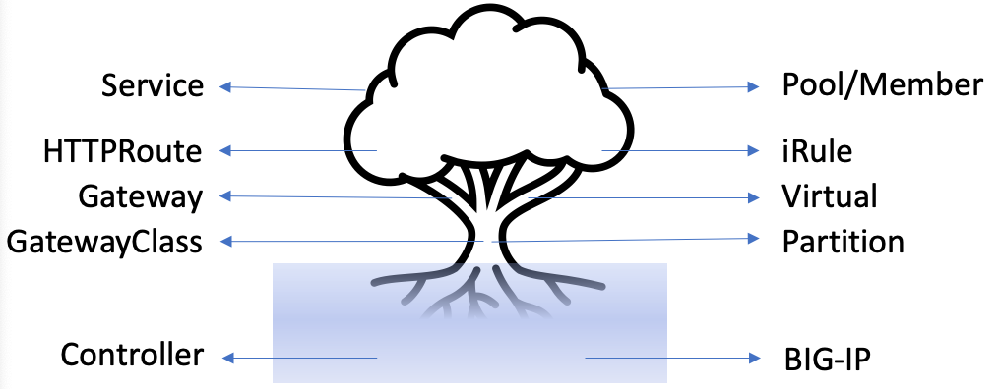

# Gateway Resources Management

The four resources of `GatewayClass` `Gateway` `HTTPRoute` `Service` are related to each other to form a tree-like association, of which GatewayClass is the root.

However, 2 bit differences with a tree are:
* A `HTTPROUTE` resource can be referenced by multiple `Gateway` from the same or different `GatewayClass`.
* A `Service` resource can be referenced by multiple `HTTPROUTE` of anywhere.

The following figure shows the analogy relationship with each resource on the BIG-IP:

In the figure above, `G` stands for Gateway, `R` stands for HTTPRoute, `S` stands for Service.

The `gwc1` `gwc2` `gwc3` are three gatewayClass resources, they are all attached to the same BIG-IP x.

Gateway-related resources will be distributed to the associated partitions with gatewayclass name, including `Gateway` and `HTTPRoute`.

It should be noted that:

* In the above figure, there are 2 gateways under `gwc1` and `gwc2` that references the same `HTTPRoute`, in this case, the `HTTPRoute` resource is logically the same resource, but the actual deliveries are **two iRules with the same content, located under gwc1 and gwc2 partitions**.

* In the figure above, iRules in two partitions gwc1 and gwc2 refer to the same service, and according to the current distribution design of the service (Pool+Member), the service is distributed to a specific partition `cis-c-tenant`. So it can be referenced by multiple iRules, so physically, the **pool converted from this service is unique**. 

`HTTPRoute` resources do not contain partition information, so only when the associated `Gateway` resource being created can it be determined which partition its corresponding irule is sent to, so `HTTPRoute` without any `Gateway` association will not be sent immediately, but will be cached until it is referenced by a virtual.

The `Service` information associated with `HTTPRoute` will be sent in the form of a pool to a specific partition "`cis-c-tenant`". In the future, it may change according to customer needs, such as distributed to a partition named `Service`.namespace.

